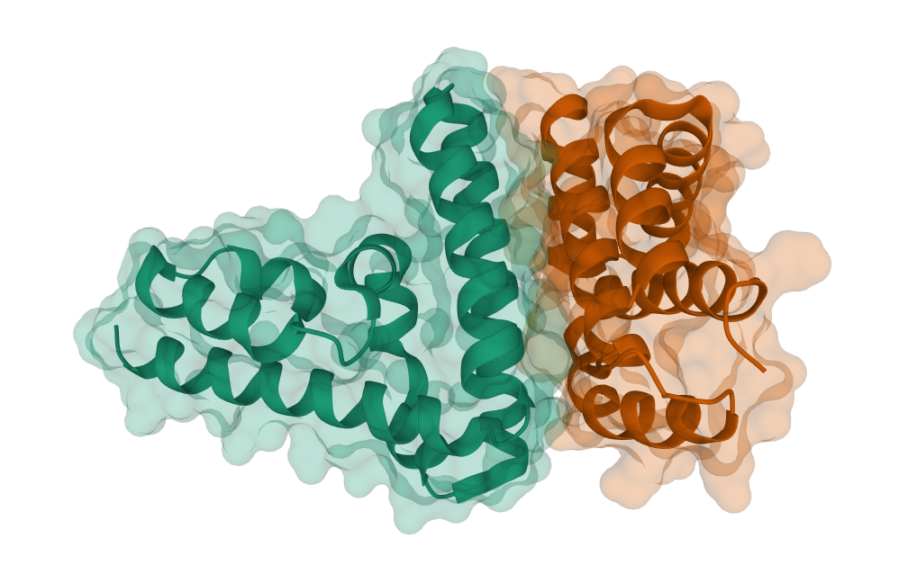
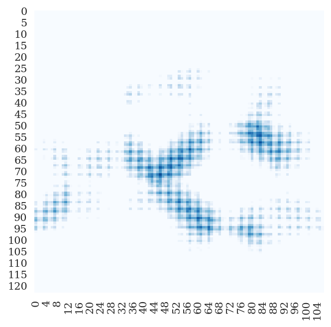
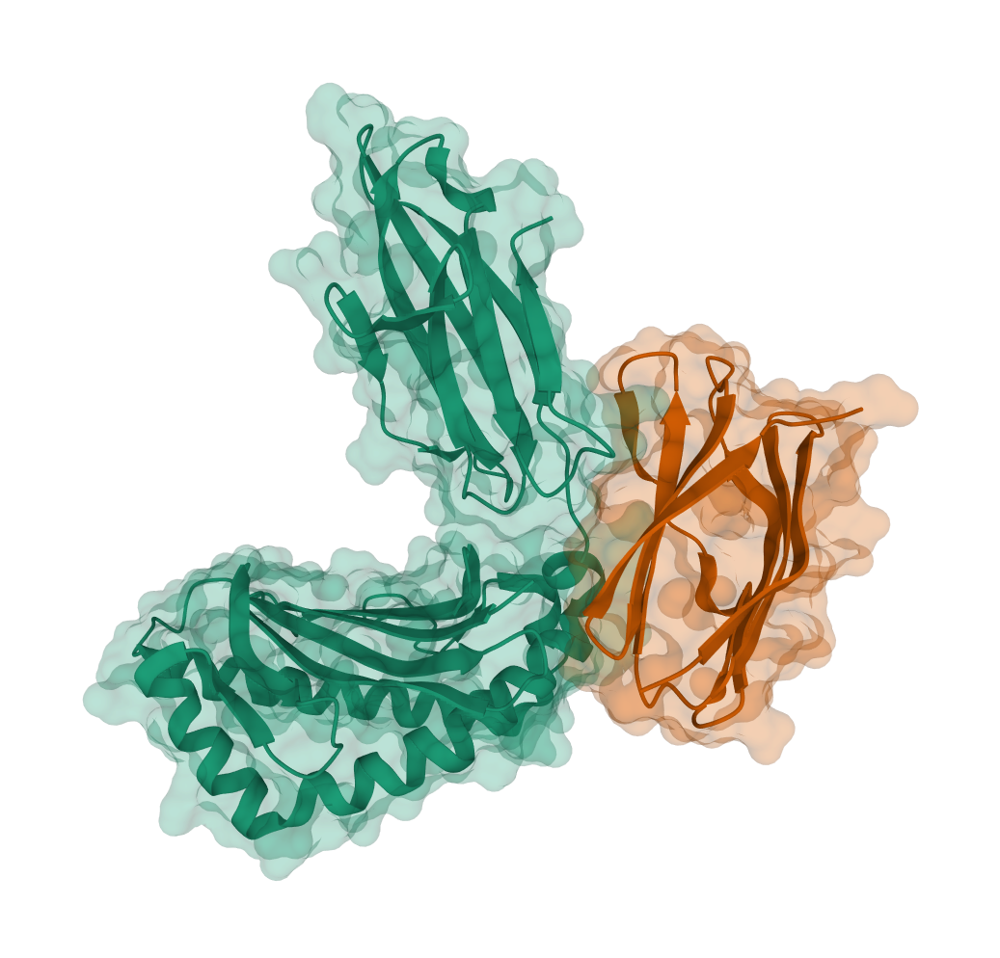
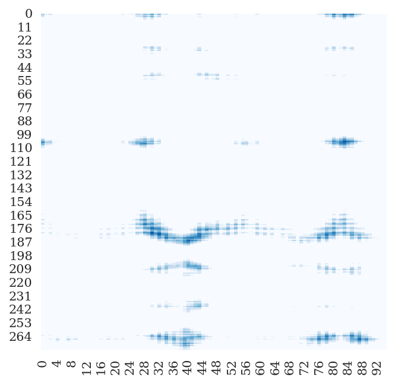
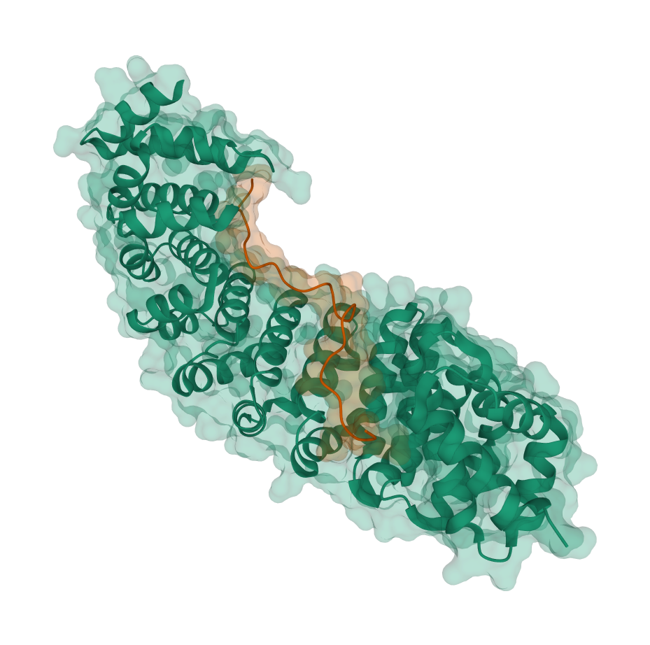
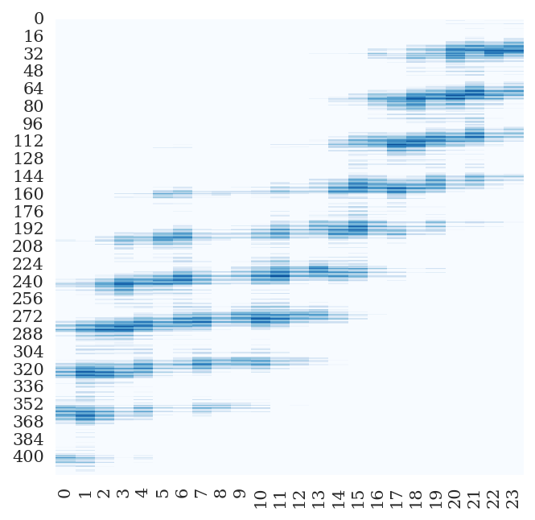
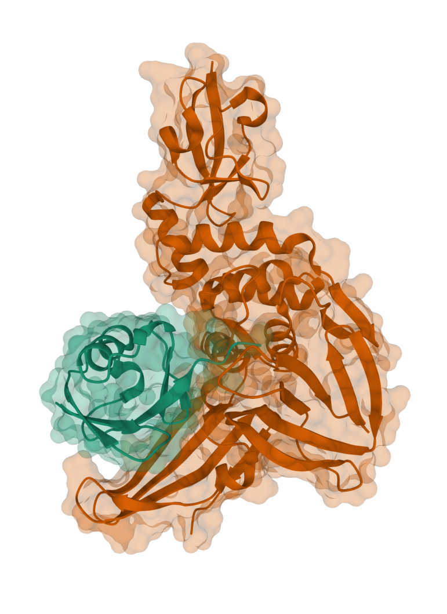
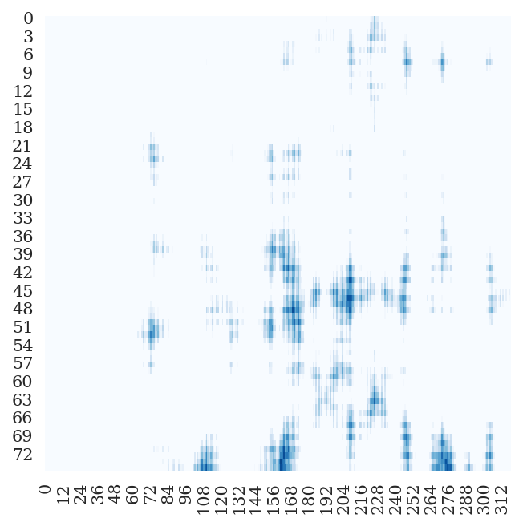
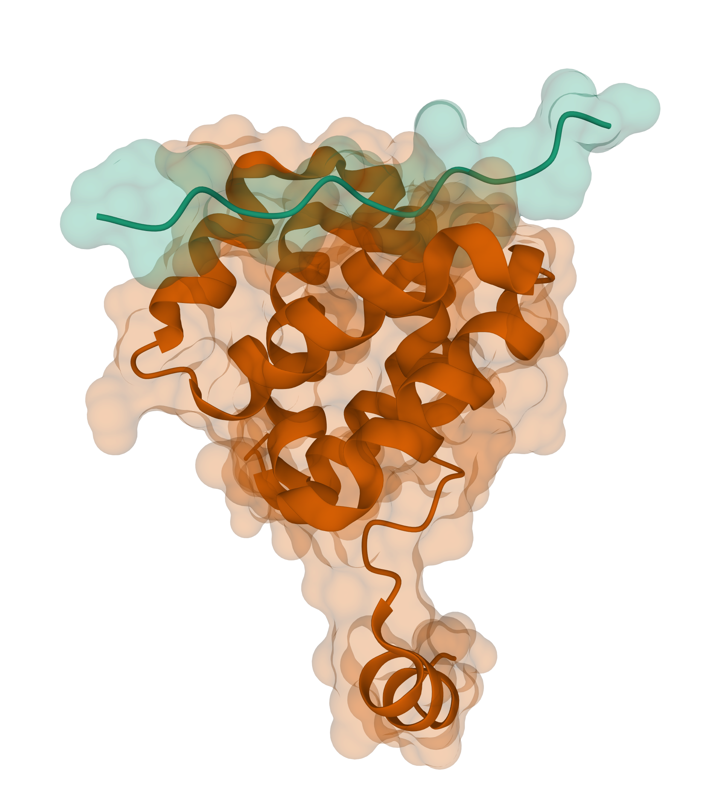
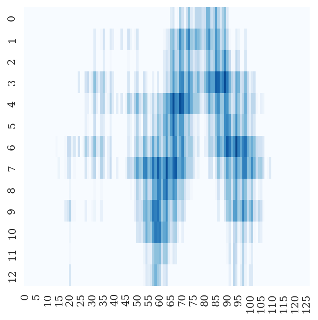

# ResNetPPI

> zhuzefeng@stu.pku.edu.cn

Currently under active development.

## Training

### Input Features

* Protein Sequence * 2
  * build MSA via HHblits
  * onehot encoding of amino acid type (20+gap+X)\*2 + (hydrophoblic+hydrophilic)\*2

### Fitting Targets

<table>
<tr>
    <td>
      PDB
    </td>
    <td>
      Dist Map
    </td>
    <td>
      pdb_id
    </td>
    <td>
      human chain
    </td>
    <td>
      virus chain
    </td>
    <td>
      len(human chain)
    </td>
    <td>
      len(virus chain)
    </td>
  </tr>
  <tr>
    <td>
      
    </td>
    <td>
      
    </td>
    <td>
      3wwt
    </td>
    <td>
      A
    </td>
    <td>
      B
    </td>
    <td>
      123
    </td>
    <td>
      107
    </td>
  </tr>
 <tr>
    <td>
      
    </td>
    <td>
      
    </td>
    <td>
      1im3
    </td>
    <td>
      E
    </td>
    <td>
      H
    </td>
    <td>
      275
    </td>
    <td>
      95
    </td>
  </tr>
  <tr>
    <td>
      
    </td>
    <td>
      
    </td>
    <td>
      6bvv
    </td>
    <td>
      A
    </td>
    <td>
      B
    </td>
    <td>
      416
    </td>
    <td>
      24
    </td>
  </tr>
  <tr>
    <td>
      
    </td>
    <td>
      
    </td>
    <td>
      4rf1
    </td>
    <td>
      B
    </td>
    <td>
      A
    </td>
    <td>
      75
    </td>
    <td>
      321
    </td>
  </tr>
  <tr>
    <td>
      
    </td>
    <td>
      
    </td>
    <td>
      6e5x
    </td>
    <td>
      B
    </td>
    <td>
      A
    </td>
    <td>
      13
    </td>
    <td>
      127
    </td>
  </tr>
</table>

## TODO

* increase mini-batch size
* multiple GPU training
* improve archi

## Hardware & Software Prerequisites

* Hardware (tested)
  * GPU: NVIDIA Tesla T4 (16G)
  * CUDA Version: 11.2
* Software
  * Python 3.8 or later in a conda environment
  * Python packages: see [requirements](requirements.txt)

## License

[Apache-2.0 License](LICENSE)
