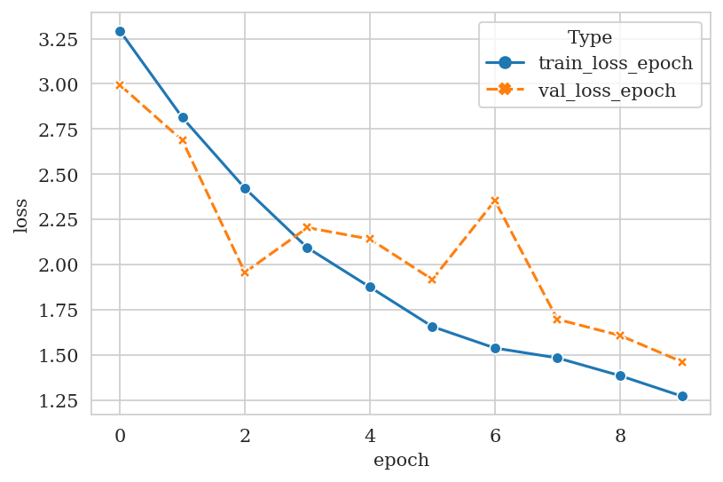

# ResNetPPI: Predicting protein inter-chain residue distances from sequences irrespective of paired MSA

> zhuzefeng@stu.pku.edu.cn (ORCID: 0000-0002-2761-3291)

A lab rotation project. Under development from 2021.12 to 2022.1.

## Summary

## Advantages

* accept variable input size
  * protein of any length
  * any number of homologous sequences
* does not rely on paired MSA, thus it can predict cross-species protein interaction

## Training

### Data Resources

* Sequence database e.g. [UniRef30_2020_06_hhsuite.tar.gz](http://wwwuser.gwdg.de/~compbiol/uniclust/2020_06/UniRef30_2020_06_hhsuite.tar.gz)
* PDB structures

### Input Features

* Protein Sequence * 2
  * build MSA via HHblits if possible
  * onehot encoding of amino acid type (20+gap+X)\*2 + (hydrophoblic+hydrophilic)\*2

### Fitting Targets

> Fitting Targets (i.e. Inter-chain Cβ-Cβ Distance Map) Examples

> NOTE: *Cα for GLY*

<table>
<tr>
    <td width=25%>
      PDB
    </td>
    <td width=25%>
      Inter-chain Cβ-Cβ Distance Map
    </td>
    <td>
      pdb_id
    </td>
    <td>
      human chain
    </td>
    <td>
      virus chain
    </td>
    <td>
      len(human chain)
    </td>
    <td>
      len(virus chain)
    </td>
  </tr>
  <tr>
    <td>
      
    </td>
    <td>
      
    </td>
    <td>
      3wwt
    </td>
    <td>
      A
    </td>
    <td>
      B
    </td>
    <td>
      123
    </td>
    <td>
      107
    </td>
  </tr>
 <tr>
    <td>
      
    </td>
    <td>
      
    </td>
    <td>
      1im3
    </td>
    <td>
      E
    </td>
    <td>
      H
    </td>
    <td>
      275
    </td>
    <td>
      95
    </td>
  </tr>
  <tr>
    <td>
      
    </td>
    <td>
      
    </td>
    <td>
      6bvv
    </td>
    <td>
      A
    </td>
    <td>
      B
    </td>
    <td>
      416
    </td>
    <td>
      24
    </td>
  </tr>
  <tr>
    <td>
      
    </td>
    <td>
      
    </td>
    <td>
      4rf1
    </td>
    <td>
      B
    </td>
    <td>
      A
    </td>
    <td>
      75
    </td>
    <td>
      321
    </td>
  </tr>
  <tr>
    <td>
      
    </td>
    <td>
      
    </td>
    <td>
      6e5x
    </td>
    <td>
      B
    </td>
    <td>
      A
    </td>
    <td>
      13
    </td>
    <td>
      127
    </td>
  </tr>
</table>

Real-valued distances are discretely binned:

* from 2Å to 20Å
* with bin size of 0.5Å
* 36 bins + 1 bin for $[20, +\infty)$

### Network Architecture

* ResNet1D
  * 1d residual block: ((Conv1d + BatchNorm1d) + ELU + (Conv1d + BatchNorm1d)) (+) ELU
  * 8 1d-blocks (64 channels)
* ResNet2D
  * 2d residual block: ((Conv2d + BatchNorm2d) + ELU + (Conv2d + BatchNorm2d)) (+) ELU
  * 16 2d-blocks (96 channels), cycling through dulations \[1,2,4,8\]
* (mini-)batch size: 1
* Cross-entropy Loss

### Model Design

* for each protein sequence (of length $L$) search homologous sequences and input the MSA (of size $K$) if possible, otherwise input the single sequence
  * use original MSA to calculate the weight $w_k$ for each homologous sequence, $w_k=\frac{1}{\text{count}(\text{sequence with identity}\ge 0.8)}$
  * calculate $M_\text{eff}=\sum_{k}^{K}w_k$
* **MSA Encoding**: perform onehot-encoding for each pairwise alignment ($2\times L_k$, consider both insertion and deletion: $\rightarrow 48\times L_k$)
  * onehot-encoding including 22+2 channels for the reference sequence, 22+2 channels for the homologous sequence
  * 22: 20 amino acid types + 1 gap + 1 unknown type
  * 2: 1 hydrophoblic + 1 hydrophilic
  * for the single sequence input, all the homologous related channels are filled with zeroes
  * hence we get $\{48\times L_k, k\in K\}$
* **MSA Embedding**: for each encoded pairwise alignment, feed into the `ResNet1D` and get embedded pairwise alignment ($64\times L_k$)
  * hence we get $\{64\times L_k, k\in K\}$
  * omit the insertion region of the homologous sequences, thus we can get a $K\times 64 \times L$ tensor
    * $x_k\in R^{64\times L}$
    * $x_k(i) \in R^{64}$
* **Paired Evolution Aggregation**
  * calculate one body term
    * $f_1(i)=\frac{1}{M_{\text{eff}_{1}}}\sum_{k}^{K_1}w_{1_k} x_{1_k}(i)$
    * $f_2(j)=\frac{1}{M_{\text{eff}_{2}}}\sum_{k}^{K_2}w_{2_k} x_{2_k}(j)$
  * apply max function
    * $A(i,c) = \max\{x_k(i,c), k \in K\}$, c: channel; $A \in R^{64\times L}$
  * calculate two body term
    * $s(i,j) = \frac{1}{\sqrt{M_{\text{eff}_{1}}\cdot M_{\text{eff}_{2}}}}[A_1(i)\otimes A_2(j)], s(i,j)\in R^{64\times 64}$
  * concatenate
    * $h(i,j) = \text{concat}(f_1(i), f_2(j), s(i,j)), h(i,j)\in R^{4224}$
* **Inter-chain Distance Estimation**
  * feed the $R^{4224 \times L_1\times L_2}$ tensor into the `ResNet2D`
  * convert the `ResNet2D` outputs into the discrete distance distribution $37 \times L_1 \times L_2$ throught a (Conv2d+BatchNorm2d+ELU) layer

#### During Training

* randomly sample 1000 homologous sequences if $K > 1000$
* randomly crop the distance matrix into $64 \times 64$ shape
  * for those input sequences of length $\le 64$, keep their original length
* loss function ignore those missing residues of PDB structure
  * definition of missing
    1. complete without any modeled atoms for a residue
    2. GLY without Cα atom
    3. non-GLY without Cβ atom and without any anchoring atoms (Cα, N, C) that can infer Cβ atom

## Current Training and Validation Results

### Dataset Preparation

* training dataset (362)
* validation dataset (100)

> NOTE: the datasets have not been carefully curated, they just serve as demo inputs for training and validation. Thus the training and validation results are just a demonstration of the model's learning ability.

## TODO

* increase mini-batch size
* multiple GPU training
* improve archi

## Hardware & Software Prerequisites

* Hardware (tested)
  * GPU: NVIDIA Tesla T4 (16G)
  * CUDA Version: 11.2
* Software
  * Python 3.8 or later in a conda environment
  * Python packages: see [requirements](requirements.txt)

## Acknowledgment

I would like to thank Jinyuan Guo and Prof. Huaiqiu Zhu for their helpful discussions and provide me with devices to develop this project.

## Reference Papers

[base on these papers](base.bib)

## License

[Apache-2.0 License](LICENSE)
